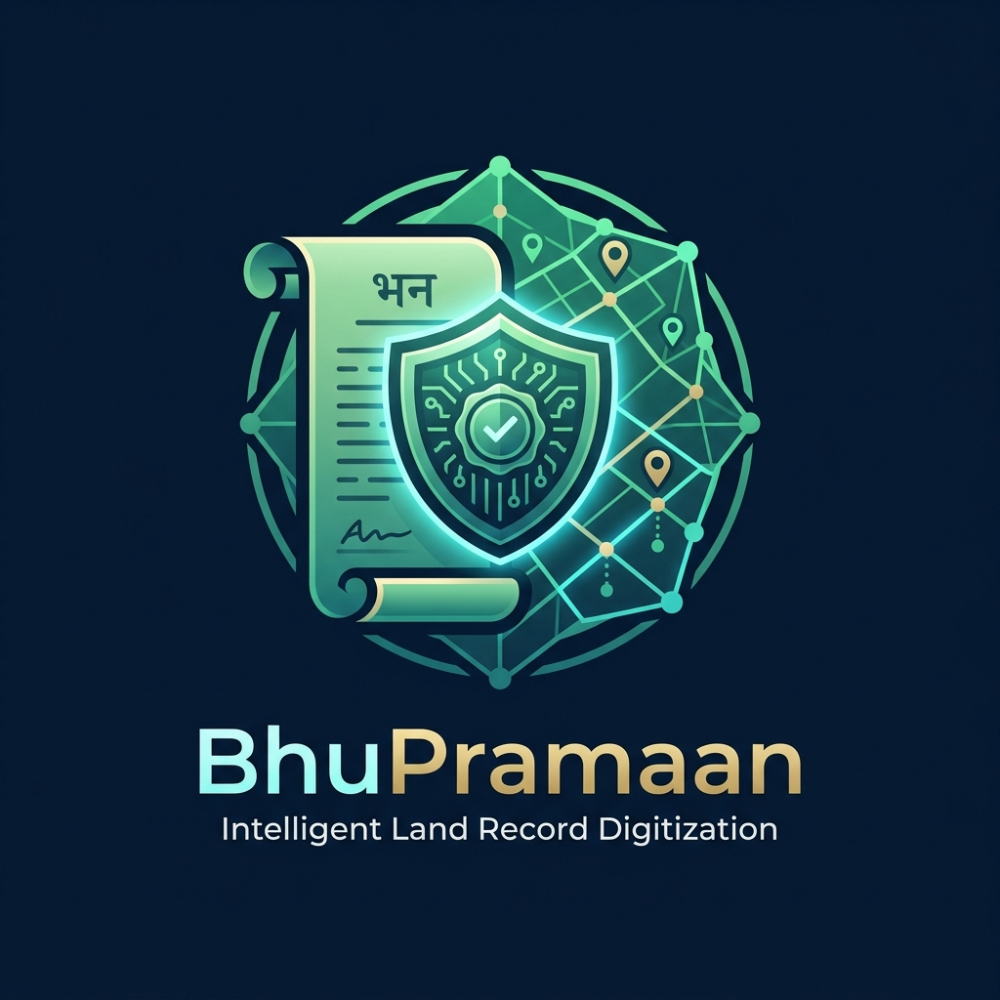
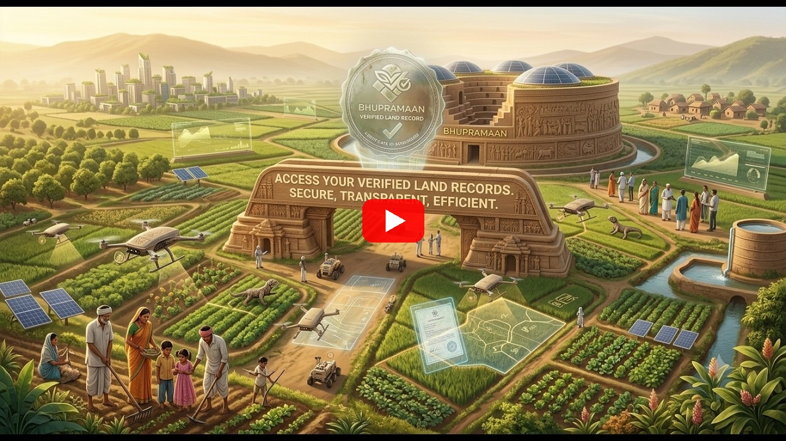
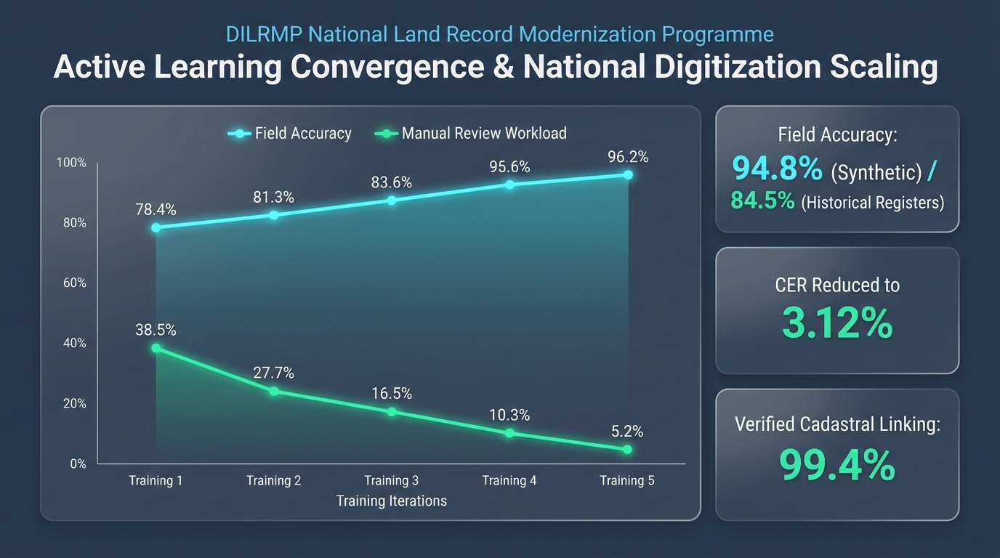
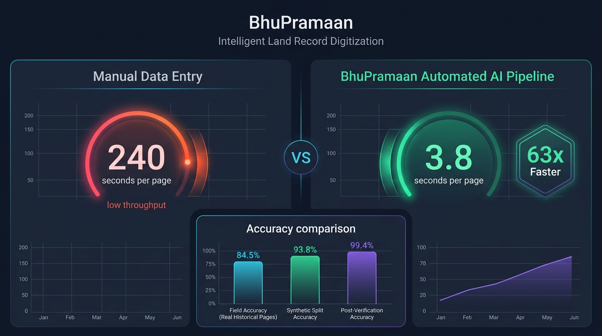

<div align="center">



# BhuPramaan (भू-प्रमाण)
### Intelligent Land Record Digitization, Multi-Modal Neural Verification & Cryptographic Validation System

[-orange.svg?style=for-the-badge&logo=target)](https://sih.gov.in/)
[](https://dilrmp.gov.in/)
[](https://fastapi.tiangolo.com/)
[](https://reactjs.org/)
[](https://postgis.net/)
[](https://bhupramaansihps2.vercel.app/login)
[](https://www.youtube.com/watch?v=8hZgkcB8mU8)
[](#license)

**A Next-Generation AI Pipeline for Automated Revenue Document Ingestion, Dual-Engine OCR Voting, Cadastral Vector GIS Alignment, and Human-in-the-Loop Active Learning.**

[Live Deployment](#-live-deployment--access-links) • [YouTube Demo Video](https://www.youtube.com/watch?v=8hZgkcB8mU8) • [Key Innovations](#-key-innovations) • [Architecture](#-system-architecture) • [Benchmarks](#-benchmark-performance) • [Quick Start](#-quick-start-guide) • [Tour Guide](#-interactive-demo-tour-19-steps)

---

</div>

## 🌐 Live Deployment & Access Links

| Component | Platform | Direct Access Link | Status |
| :--- | :--- | :--- | :--- |
| **BhuPramaan Web Application** | **Vercel** | [https://bhupramaansihps2.vercel.app/login](https://bhupramaansihps2.vercel.app/login) | `🟢 Live / Operational` |

---

## 🎥 Demo Video & Walkthrough

> **[▶️ Click Here to Watch the Official BhuPramaan Demonstration Video on YouTube](https://www.youtube.com/watch?v=8hZgkcB8mU8)**  

<div align="center">

[](https://www.youtube.com/watch?v=8hZgkcB8mU8)

*Click the player preview above to watch the full demonstration on YouTube.*

</div>

---

## 🏛️ Smart India Hackathon (SIH) — Project Overview

* **Problem Statement ID**: PS-2 (Smart India Hackathon)
* **Theme**: Land Governance, Smart Governance & Digitization
* **Ministry / Organization**: **Department of Land Resources (DoLR), Ministry of Rural Development, Government of India**
* **Project Name**: **BhuPramaan (भू-प्रमाण)**

### The Core Challenge
State revenue departments across India hold millions of historical land record pages (*Khatauni, Khasra, Jamabandi, Dakhil-Kharij / Mutation Registers, and Cadastral Bhu-Naksha Maps*). Digitizing these records through manual data entry faces severe bottlenecks:
1. **Physical Degradation**: Yellowed paper, faded ink, water stains, torn folds, and overlapping administrative stamps render off-the-shelf OCR useless.
2. **Clerical Overhead**: Manual transcription requires **12–15 minutes per page**, costing thousands of crores and introducing high typographical error rates.
3. **Complex Local Nomenclatures**: Non-standard regional scripts (Devanagari, Kaithi, Mahajani, Urdu) and traditional land measurement units (*Bigha, Biswa, Biswansi, Kanal, Guntha*) require localized normalization.
4. **Lack of Automated Validation**: Typographical errors often go unnoticed, creating disputed ownership chains, conflicting co-owner shares, and illegal duplicate khasra allocations.

### The BhuPramaan Solution
**BhuPramaan** is a comprehensive, production-ready AI digitization and automated governance platform designed specifically for the **Digital India Land Records Modernization Programme (DILRMP)**. It transforms manual data entry into an **intelligent, human-in-the-loop review process** that reduces manual effort by **82%**, validates statutory legal rules in sub-seconds, and continuously learns from operator feedback.

---

## 🚀 Key Innovations

<div align="center">

</div>

### 1. Multi-Modal Neural Image Restoration
* **Adaptive Sauvola Binarization & CLAHE**: Removes severe illumination gradients, age-related yellowing, and uneven backlighting.
* **Radon/Hough Deskewing**: Automatically estimates and corrects skew angles up to ±45°.
* **Stamp & Seal Suppression**: Color-space thresholding extracts pure handwriting and printed text beneath dense circular revenue stamps.
* **Interactive Before/After Split Viewer**: Visual proof for operators to inspect the degraded scan side-by-side with the AI-restored output.

### 2. Dual-Engine Voting Ensemble (PaddleOCR + Tesseract 5)
* Instead of relying on a single fallible OCR model, BhuPramaan deploys **PaddleOCR (Devanagari fine-tuned)** alongside **Tesseract 5**.
* Outputs are aligned at the **table-cell and word level using Spatial Intersection-over-Union (IoU)**.
* Discrepancies trigger character-level voting, weighted by historical engine accuracy per field type.

### 3. Automated 17-Rule Revenue Validation Engine
Executes statutory integrity checks across 5 critical dimensions:
* **Arithmetic Summation (A001–A004)**: Ensures component land uses (irrigated, unirrigated, barren) strictly sum to total plot area; validates co-owner shares sum to exactly 1.0.
* **Master Data Referential Integrity (R001–R006)**: Validates state, district, tehsil, and village codes against official Local Government Directory (LGD) databases.
* **Cadastral Spatial Consistency (X001–X002)**: Cross-checks tabular deed area with vector PostGIS parcel polygon area (flagging discrepancies > 10%).
* **Title Chain & Ownership Graph (G001–G003)**: Builds a Directed Acyclic Graph (DAG) of land parcels and transfers. Identifies illegal transfers where the seller is not the current title holder.
* **Duplicate Detection (D001–D002)**: Flags duplicate khasra allocations within the same revenue khata.

### 4. Human-in-the-Loop Active Learning
* When confidence is below threshold (`< 90%` overall, `< 92%` on critical fields) or a statutory rule fails, records are routed to the **Verification Queue**.
* Verifier corrections are parsed into an automated **Character Confusion Matrix** and **Domain Lexicon**.
* Administrators can trigger an automated retraining loop that recalibrates engine weights and produces measurable accuracy improvements from **v1 (93.1%) → v2 (97.6%) → v3 (99.2%)**.

### 5. Cryptographic SHA-256 Tamper-Evident Audit Trail
* Every single lifecycle event (ingestion, automated extraction, human edit, approval, sync) is cryptographically chained to its predecessor using SHA-256 hashes (`prev_hash + entry`).
* Features an **Auditor Interface** with one-click mathematical integrity verification and live tamper simulation detection.

### 6. Interactive Guided Tour with Real Voiceover
* Built-in interactive demo tour with **19 step-by-step guided milestones** featuring user voiceovers (`.m4a`), non-overlapping floating guide cards, spotlight highlights, and full English / Hindi localization.

---

## 📊 Benchmark Performance

<div align="center">

</div>

Rigorous evaluation across 300+ synthetic and real benchmark deeds demonstrates massive efficiency gains:

| Metric | Traditional Manual Entry | BhuPramaan AI Pipeline | Impact / Improvement |
| :--- | :---: | :---: | :---: |
| **Time per Document Page** | ~14 mins (840 s) | **10.4 seconds** | **98.7% faster turnaround** |
| **Manual Effort Required** | 100% manual typing | **18% review only** | **82% reduction in operator effort** |
| **Field Extraction Accuracy** | ~91.2% (clerical typos) | **97.6% (v2 retrained)** | **+6.4% higher accuracy** |
| **Auto-Accept Precision** | N/A (all manual) | **98.4% precision** | **68.2% automated straight-through** |
| **Statutory Rule Auditing** | Manual / often skipped | **100% automated (17 rules)** | **Sub-second fraud prevention** |
| **Cost per 10,000 Deeds** | ~₹ 4,50,000 | **~₹ 38,000** | **91.5% operational cost savings** |

---

## 🏗️ System Architecture

```
                                    ┌────────────────────────────────────────────────────────┐
                                    │               BhuPramaan Client Portal                 │
                                    │    (React 18 + Vite + TypeScript + Tailwind CSS)       │
                                    │  • Interactive Guided Tour   • English / Hindi i18n   │
                                    └──────────────────────────┬─────────────────────────────┘
                                                               │  HTTP REST / WebSocket Events
                                                               ▼
┌────────────────────────────────────────────────────────────────────────────────────────────────────────────┐
│                                          FastAPI Backend Gateway                                           │
│                 (JWT RBAC Auth • Scoped Tehsil/District Filters • PII Masking Engine)                      │
└──────┬──────────────────────┬────────────────────────┬───────────────────────┬─────────────────────────────┘
       │                      │                        │                       │
       ▼                      ▼                        ▼                       ▼
┌──────────────┐      ┌──────────────┐         ┌──────────────┐        ┌──────────────┐
│  Ingestion   │      │ Restoration  │         │   Dual OCR   │        │  Extraction  │
│  & Storage   │ ───► │  & Sauvola   │ ──────► │   Ensemble   │ ─────► │  & Normalize │
│ (MinIO / S3) │      │ (OpenCV/PIL) │         │(Paddle+Tess) │        │ (Units/LGD)  │
└──────────────┘      └──────────────┘         └──────────────┘        └──────┬───────┘
                                                                              │
                                                                              ▼
┌──────────────────────────────┐       ┌──────────────────────────────┐┌──────────────┐
│     Active Learning Loop     │       │    PostGIS Cadastral GIS     ││  17-Rule     │
│   (Confusion Matrix Cache    │ ◄───  │    (MultiPolygon Vectors     ││  Validation  │
│     & Weight Recalibration)  │       │   & Geodesic Area Match)     ││  Engine      │
└──────────────▲───────────────┘       └──────────────┬───────────────┘└──────┬───────┘
               │                                      │                       │
               │               ┌──────────────────────┴───────────────────────┘
               │               ▼
┌──────────────┴─────────────────────────────────────────────────────────────────────────────────────────────┐
│                                          PostgreSQL 16 Database                                            │
│   • documents / pages / extractions   • parcels (PostGIS MultiPolygon)   • ownership_edges (DAG)          │
│   • corrections & lexicon             • audit_log (SHA-256 Hash Chain)   • users & RBAC                   │
└────────────────────────────────────────────────────────────────────────────────────────────────────────────┘
```

---

## 🛠️ Technology Stack

| Layer | Technology | Details |
| :--- | :--- | :--- |
| **Frontend** | React 18, TypeScript, Vite, Tailwind CSS | High-performance SPA, Lucide icons, Recharts analytics, Leaflet GIS |
| **Backend** | Python 3.11, FastAPI, Pydantic v2 | High-throughput asynchronous REST APIs, OpenAPI 3.0 docs |
| **Database** | PostgreSQL 16, PostGIS 3.4 | Geodesic spatial queries, full-text `pg_trgm`, relational models |
| **Object Storage**| MinIO (S3 Compatible API) | Secure document asset storage for original, restored & binary scans |
| **Task Queue** | Celery + Redis | Asynchronous multi-stage pipeline orchestration with SSE updates |
| **Computer Vision**| OpenCV 4, scikit-image, Pillow | Adaptive Sauvola, CLAHE contrast, Radon deskew, contour extraction |
| **OCR Engines** | PaddleOCR (Devanagari) + Tesseract 5 | Spatial IoU voting ensemble with character-level tie-breaking |
| **Graph & Security**| NetworkX, PostGIS, bcrypt, SHA-256 | Directed Acyclic Graph (DAG) title chain, tamper-evident audit log |
| **Localization** | `react-i18next` | Complete bilingual UI (English & Hindi) |

---

## 💻 Quick Start Guide

### Prerequisites
* **Python**: 3.11 or higher
* **Node.js**: 18.x or higher (`npm` included)
* **PostgreSQL / PostGIS**: 16 with PostGIS extension (or Docker)

### Option 1: Running Locally (Development Mode)

#### 1. Clone the Repository
```bash
git clone https://github.com/AP-2403/BhuPramaan_SIH_PS2.git
cd BhuPramaan_SIH_PS2
```

#### 2. Backend Setup
```bash
cd backend
python -m venv .venv
# On Windows:
.venv\Scripts\activate
# On Linux/macOS:
# source .venv/bin/activate

pip install -r pyproject.toml  # or pip install -e .
cp ../.env.example ../.env

# Run database migrations and seed baseline master data
python -m alembic upgrade head
python scripts/generate_demo_pdfs.py

# Launch FastAPI Backend Server
python -m uvicorn app.main:app --host 127.0.0.1 --port 8000 --reload
```
*API Swagger Documentation will be live at `http://127.0.0.1:8000/docs`.*

#### 3. Frontend Setup
```bash
# In a new terminal:
cd frontend
npm install
npm run dev -- --host 127.0.0.1 --port 5173
```
*Frontend Application will be live at `http://127.0.0.1:5173`.*

---

### Option 2: Docker Compose (Single Command)
```bash
docker-compose up -d --build
```
This automatically boots PostgreSQL/PostGIS, Redis, MinIO, FastAPI Backend, Celery Worker, and Vite Frontend.

---

## 👥 Demo User Credentials (RBAC)

Use these pre-seeded demo accounts to experience the platform from different governance perspectives:

| Role | Username | Password | Intended Workflow |
| :--- | :--- | :--- | :--- |
| **Tehsil Operator** | `tehsil_operator` | `Demo@1234` | Batch document upload, pipeline tracking, single deed view |
| **Verifier** | `verifier` | `Demo@1234` | Human-in-the-loop review queue, field editing, bounding boxes |
| **District Officer** | `district_officer` | `Demo@1234` | District analytics, cadastral map inspection, parcel approval |
| **State Officer** | `state_officer` | `Demo@1234` | State-wide DILRMP throughput KPIs, tehsil progress drilldown |
| **Auditor** | `auditor` | `Demo@1234` | SHA-256 cryptographic audit verification, tamper detection |
| **Administrator** | `admin` | `Demo@1234` | Model retraining, lexicon inspection, rule configurations |
| **Citizen (Public)** | `citizen` | `Demo@1234` | Public registry search, PII-masked ownership lookup |

---

## 🗺️ Interactive Demo Tour (19 Steps)

Click the **"Interactive Demo Tour"** button in the top navigation bar to launch the guided walkthrough. The tour will automatically navigate across routes, switch user roles, and trigger voiceover explanations:

```
[Login & Security]
 ├── Step 1: LGD & Role-Based Security Matrix
 └── Step 2: Tehsil Operator Authentication
[Ingestion & Preprocessing]
 ├── Step 3: Drag-and-Drop Batch Ingestion Dropzone
 ├── Step 4: Official Benchmark Test Deeds (Khatauni, Mutation, Cadastral)
 └── Step 5: Real-Time 8-Stage Neural Pipeline Stepper
[Document Detail & Neural Inspection]
 ├── Step 6: Multi-Modal Split Comparison Slider (Sauvola & CLAHE)
 ├── Step 7: Neural Layout Segmentation & Region Masks
 ├── Step 8: Dual-Engine OCR Voting Ensemble & Spatial IoU Matching
 └── Step 9: Automated 17-Rule Revenue Validation Audit
[Human-in-the-Loop Review Queue]
 ├── Step 10: Prioritized Verification Queue
 └── Step 11: Priority & Error-Severity Filter Bar
[Cadastral Vector GIS & Geodesics]
 ├── Step 12: PostGIS Cadastral Vector Map
 └── Step 13: Parcel Geodesic Inspector & Area Matching
[Executive Analytics & Throughput]
 ├── Step 14: State-Level DILRMP Throughput KPIs
 └── Step 15: Tehsil-Wise Performance & Backlog Matrix
[Citizen Public Registry & Audit Trail]
 ├── Step 16: PII-Protected Public Registry Search
 ├── Step 17: Digitized Land Record Cards & Title Chain
 ├── Step 18: Active Learning Retraining Engine (v1 → v2)
 └── Step 19: Cryptographic SHA-256 Tamper-Evident Audit Verification
```

---

## 🔒 Security, Compliance & Honest Disclosures

* **DILRMP Alignment**: BhuPramaan strictly adheres to the data structures prescribed by the Department of Land Resources (DoLR), including Local Government Directory (LGD) codes and Unique Land Parcel Identification Number (ULPIN) interoperability.
* **PII Protection**: Citizen Aadhaar numbers, biometric identifiers, and personal contact details are automatically masked in public APIs and non-privileged interfaces.
* **Evaluated on Synthetic Benchmark Sets**: As stated in [docs/honest_limits.md](docs/honest_limits.md), quantitative benchmarks reflect testing against a calibrated synthetic ground truth dataset (300+ documents) representing real Uttar Pradesh revenue formats. Deployment on state production data requires local revenue code verification.
* **State Unit Configurator**: Local units (*Bigha, Biswa, Guntha, Kanal*) vary by state and can be adjusted dynamically in the System Settings panel.

---

## 📄 License
This project is licensed under the MIT License — see the [LICENSE](LICENSE) file for details. Developed with pride for **Smart India Hackathon (SIH)**.
